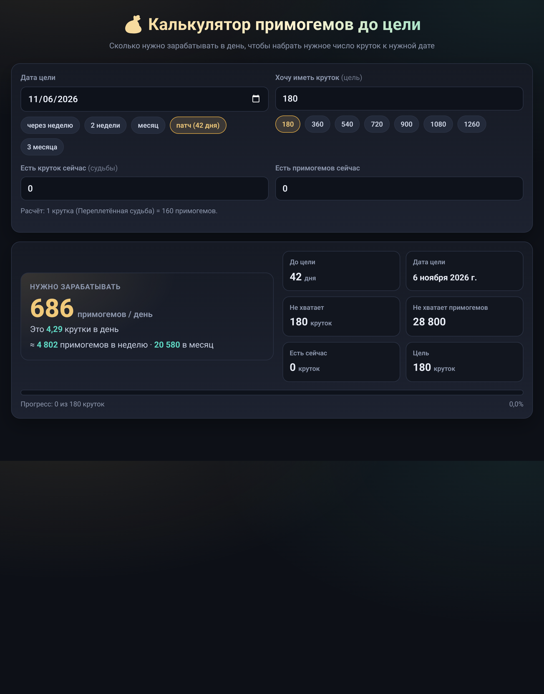

# 💰 Калькулятор примогемов — сколько нужно фармить в день

[](https://github.com/Bondrud/Mini-programm/actions/workflows/ci.yml)
[](https://github.com/Bondrud/Mini-programm/actions/workflows/deploy.yml)
[](LICENSE)

Мини-приложение для игроков Genshin Impact. Отвечает на главный вопрос каждого копильщика: **сколько примогемов нужно зарабатывать в день, чтобы к нужной дате накопить нужное число круток?**



## ✨ Возможности

- 📅 **Дата цели** — с быстрыми пресетами: неделя, 2 недели, месяц, патч (42 дня), 3 месяца
- 🎯 **Цель в крутках** — пресеты от 180 до 1260 (180 круток ≈ гарантия на баннере)
- 💎 **Учёт текущих накоплений** — судьбы и примогемы, что уже есть
- 📊 **Сводка** — сколько не хватает, норма в день / неделю / месяц, прогресс-бар
- ⚠️ **Предупреждения** — дата прошла, дата сегодня, остался 1 день
- 🌙 Тёмная тема, адаптивная вёрстка — удобно и с телефона

## 🚀 Запуск

Приложение — обычная статическая страница, ничего устанавливать не нужно:

1. скачайте репозиторий (`Code → Download ZIP` или `git clone`);
2. откройте `index.html` в браузере.

Либо поднимите локальный сервер:

```bash
python3 -m http.server 8000
# http://localhost:8000
```

## 🧮 Как считается

1 крутка (Переплетённая судьба) = **160 примогемов**.

```
не хватает  = цель × 160 − (судьбы × 160 + примогемы)
норма в день = не хватает / дней до цели   (округление вверх)
```

Если дата цели — сегодня или уже прошла, расчёт всё равно показывается (как для 1 дня), плюс выводится предупреждение.

## 📁 Структура проекта

```
├── index.html              # разметка страницы
├── css/
│   └── styles.css          # стили: тёмная тема, карточки, адаптив
├── js/
│   ├── utils.js            # форматирование чисел, склонения, даты
│   ├── calc.js             # чистая логика расчёта (без DOM)
│   ├── render.js           # отрисовка результата в HTML
│   └── app.js              # точка входа: форма, обработчики, перерисовка
├── tests/
│   ├── calc.test.js        # тесты логики расчёта
│   ├── utils.test.js       # тесты утилит
│   └── render.test.js      # тесты отрисовки
├── docs/
│   └── screenshot.png      # скриншот для README
└── .github/workflows/      # CI (тесты) и автодеплой на GitHub Pages
```

Модули сознательно написаны как обычные скрипты (не ES-модули), чтобы страница работала даже при открытии по двойному клику через `file://`. При этом `utils.js`, `calc.js` и `render.js` экспортируют свой API и в CommonJS — поэтому они тестируются в Node без браузера и без зависимостей.

## 🧪 Тесты

```bash
npm test        # или просто: node --test
```

Тесты покрывают логику расчёта (округления, крайние случаи с датами), склонения и отрисовку. CI прогоняет их на Node 20 и 22 при каждом пуше и в pull request'ах.

## 🌐 GitHub Pages

После мержа в `main` сайт автоматически публикуется на GitHub Pages — workflow [`deploy.yml`](.github/workflows/deploy.yml). Чтобы это заработало, включите в настройках репозитория: **Settings → Pages → Source: GitHub Actions**.

## 📄 Лицензия

[MIT](LICENSE) — используйте и форкайте свободно.
